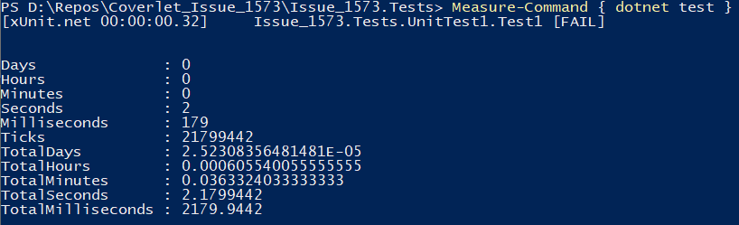

# Coverlet_Issue_1573

It seems that the source generator `EnumExtensions` from the package `NetEscapades.EnumGenerators` increases the instrumentation time drastically.
This was expected as source generators can easily increase the IL code in the assembly that gets instrumented. 
For source generated code it's not possible to collect coverage information as no source files exist. Thus it is best to filter it out anyway. 

The execution time of the tests and coverage on my local PC is the following:


Now when excluding the source generated code by adding a filter (`NetEscapades.EnumGenerators` has the suffix `*.g.cs`)

```xml
<PropertyGroup>
    <CollectCoverage>true</CollectCoverage>
    <CoverletOutputFormat>json,cobertura</CoverletOutputFormat>
    <IncludeTestAssembly>true</IncludeTestAssembly>
    <ExcludeByFile>**/*.g.cs</ExcludeByFile>
</PropertyGroup>
```

The execution is much faster:

